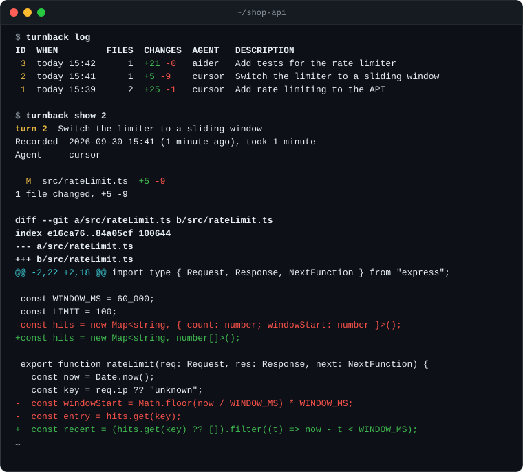
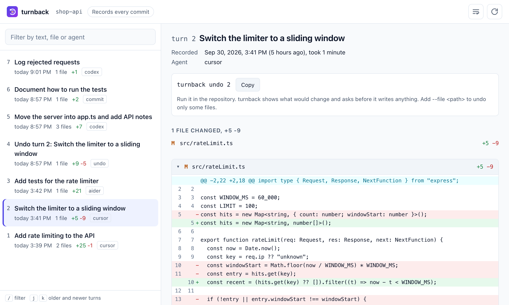
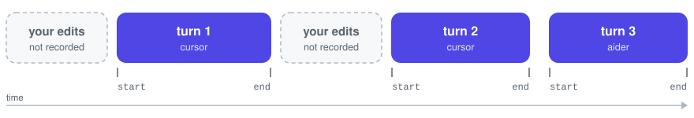
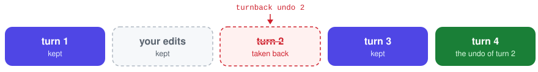

<p align="center">
  
</p>

<h1 align="center">turnback</h1>

<p align="center">
  <strong>Per-turn history and selective undo for AI coding agents, built on git.</strong>
</p>

<p align="center">
  <a href="https://github.com/Waiivyy/turnback/releases/latest"></a>
  <a href="https://github.com/Waiivyy/turnback/actions/workflows/ci.yml"></a>
  <a href="go.mod"></a>
  
  <a href="LICENSE"></a>
</p>

<p align="center">
  <a href="#install">Install</a> &nbsp;&middot;&nbsp;
  <a href="#quickstart">Quickstart</a> &nbsp;&middot;&nbsp;
  <a href="#example-session">Example</a> &nbsp;&middot;&nbsp;
  <a href="#commands">Commands</a> &nbsp;&middot;&nbsp;
  <a href="#browse-turns-in-your-browser">Web page</a> &nbsp;&middot;&nbsp;
  <a href="#safety">Safety</a> &nbsp;&middot;&nbsp;
  <a href="#faq">FAQ</a>
</p>

<p align="center">
  
</p>

AI coding agents change many files in a single turn. When one of those turns
goes wrong, your options are to pick through the diff by hand, or to reset to
an older commit and lose the good turns that came after it, along with the
edits you made yourself in between.

**turnback** records every agent turn as its own unit, right on top of git.
You can list your turns, see exactly what each one changed, and undo only the
one you don't want while everything else stays put.

- **Selective undo.** Take one turn back out, or one file of it, and keep every
  change that came after, whether a later turn or you made it.
- **Per-turn history.** Every turn gets an id, a time, a description, the files
  it touched and its diff.
- **A page to browse it all.** `turnback ui` opens a local, read-only web page
  with every turn, the files it touched and its diff, updated as you work.
- **Your edits stay yours.** Changes you make between agent turns are never
  counted as part of a turn, and an undo keeps them.
- **Safe by default.** Every undo is a dry run until you confirm. Overlapping
  edits are reported, never merged into a mess, and every undo can itself be
  undone.
- **Out of git's way.** No commits, branches, stash entries or index changes in
  your repository. Files your `.gitignore` excludes are never read or written.
- **One small binary.** Written in Go, no dependencies beyond git, nothing to
  configure. Works with any agent: Cursor, Copilot, Aider, Codex, or anything
  else that edits files in your working tree.

## Install

**macOS and Linux**, one line, no Go needed:

```bash
curl -fsSL https://raw.githubusercontent.com/Waiivyy/turnback/main/install.sh | sh
```

The [script](install.sh) downloads the binary for your machine from the
[latest release](https://github.com/Waiivyy/turnback/releases/latest), checks
its SHA-256 checksum and installs it to `~/.local/bin`, without root rights.
If that folder is not on your `PATH` yet, the script prints the line to add.
Set `TURNBACK_INSTALL_DIR` to put it elsewhere, or `TURNBACK_VERSION=v0.1.0`
to pin a version.

**Windows**, or by hand: download the archive for your system from the
[releases page](https://github.com/Waiivyy/turnback/releases/latest), unpack
it and put `turnback` on your `PATH`.

**With Go** (1.22 or newer):

```bash
go install github.com/Waiivyy/turnback@latest
```

**From source:**

```bash
git clone https://github.com/Waiivyy/turnback.git
cd turnback
go build -o turnback .
```

turnback needs **git 2.30 or newer**. Check the install with
`turnback --version`.

To uninstall, delete the binary (`rm ~/.local/bin/turnback` if you used the
script) and the `.turnback/` folder in any repository you used it in.

## Quickstart

Inside any git repository:

```bash
turnback start -m "Add rate limiting"   # right before you prompt the agent
# ... the agent edits files ...
turnback end                            # when it is done
turnback log                            # every turn, newest first
turnback show 1                         # what turn 1 changed
turnback undo 1                         # take turn 1 back out, keep the rest
```

That is the whole workflow. `turnback status` shows what the turn in progress
has changed so far, and `turnback end --discard` drops a turn you don't want to
keep.

## Example session

A small TypeScript API, three agent turns, and one manual README edit made
between the first two turns. All output below is real.

### Record turns

```console
$ turnback start -m "Add rate limiting to the API" --agent cursor
Initialized turnback in .turnback/ (git ignores this folder).
Recording a new turn: Add rate limiting to the API (snapshot of 3 files).
Run 'turnback end' when the agent is done.

$ turnback end
Recorded turn 1: Add rate limiting to the API
  A  src/rateLimit.ts  +23
  M  src/server.ts     +2 -1
2 files changed, +25 -1
See it with 'turnback show 1', undo it with 'turnback undo 1'.
```

### List and inspect them

```console
$ turnback log
ID  WHEN         FILES  CHANGES  AGENT   DESCRIPTION
 3  today 15:42      1  +21 -0   aider   Add tests for the rate limiter
 2  today 15:41      1  +5 -9    cursor  Switch the limiter to a sliding window
 1  today 15:39      2  +25 -1   cursor  Add rate limiting to the API

$ turnback log --file src/rateLimit.ts
ID  WHEN         FILES  CHANGES  AGENT   DESCRIPTION
 2  today 15:41      1  +5 -9    cursor  Switch the limiter to a sliding window
 1  today 15:39      2  +25 -1   cursor  Add rate limiting to the API
```

The README edit made between turns 1 and 2 appears in neither turn.

<details>
<summary><code>turnback show 2</code> prints the turn and its diff</summary>

```console
$ turnback show 2
turn 2  Switch the limiter to a sliding window
Recorded  2026-09-30 15:41 (1 minute ago), took 1 minute
Agent     cursor

  M  src/rateLimit.ts  +5 -9
1 file changed, +5 -9

diff --git a/src/rateLimit.ts b/src/rateLimit.ts
index e16ca76..84a05cf 100644
--- a/src/rateLimit.ts
+++ b/src/rateLimit.ts
@@ -2,22 +2,18 @@ import type { Request, Response, NextFunction } from "express";
 
 const WINDOW_MS = 60_000;
 const LIMIT = 100;
-const hits = new Map<string, { count: number; windowStart: number }>();
+const hits = new Map<string, number[]>();
 
 export function rateLimit(req: Request, res: Response, next: NextFunction) {
   const now = Date.now();
   const key = req.ip ?? "unknown";
-  const windowStart = Math.floor(now / WINDOW_MS) * WINDOW_MS;
-  const entry = hits.get(key);
+  const recent = (hits.get(key) ?? []).filter((t) => now - t < WINDOW_MS);
 
-  if (!entry || entry.windowStart !== windowStart) {
-    hits.set(key, { count: 1, windowStart });
-    return next();
-  }
-  if (entry.count >= LIMIT) {
+  if (recent.length >= LIMIT) {
     res.status(429).json({ error: "Too many requests" });
     return;
   }
-  entry.count++;
+  recent.push(now);
+  hits.set(key, recent);
   next();
 }
```

</details>

### Undo one turn

The sliding window from turn 2 turned out to be a bad idea. Undo just that
turn, and keep the tests from turn 3:

```console
$ turnback undo 2
Undo turn 2: Switch the limiter to a sliding window

  M  src/rateLimit.ts  put back the version from before turn 2

Note: turn 3 came after turn 2. Its changes are kept, but if it relies on
what turn 2 did, run your tests after the undo.

diff --git a/src/rateLimit.ts b/src/rateLimit.ts
index 84a05cf..e16ca76 100644
--- a/src/rateLimit.ts
+++ b/src/rateLimit.ts
@@ -2,18 +2,22 @@ import type { Request, Response, NextFunction } from "express";
 
 const WINDOW_MS = 60_000;
 const LIMIT = 100;
-const hits = new Map<string, number[]>();
+const hits = new Map<string, { count: number; windowStart: number }>();
 
 export function rateLimit(req: Request, res: Response, next: NextFunction) {
   const now = Date.now();
   const key = req.ip ?? "unknown";
-  const recent = (hits.get(key) ?? []).filter((t) => now - t < WINDOW_MS);
+  const windowStart = Math.floor(now / WINDOW_MS) * WINDOW_MS;
+  const entry = hits.get(key);
 
-  if (recent.length >= LIMIT) {
+  if (!entry || entry.windowStart !== windowStart) {
+    hits.set(key, { count: 1, windowStart });
+    return next();
+  }
+  if (entry.count >= LIMIT) {
     res.status(429).json({ error: "Too many requests" });
     return;
   }
-  recent.push(now);
-  hits.set(key, recent);
+  entry.count++;
   next();
 }

Apply this undo? [y/N] y

Undid turn 2: 1 file changed, +9 -5.
Recorded as turn 4. To take this undo back, run 'turnback undo 4'.
```

The undo is a turn of its own, so it shows up in the log and can be undone
like any other:

```console
$ turnback log
ID  WHEN         FILES  CHANGES  AGENT   DESCRIPTION
 4  today 16:15      1  +9 -5            Undo turn 2: Switch the limiter to a sliding window
 3  today 15:42      1  +21 -0   aider   Add tests for the rate limiter
 2  today 15:41      1  +5 -9    cursor  Switch the limiter to a sliding window
 1  today 15:39      2  +25 -1   cursor  Add rate limiting to the API

$ turnback undo 4 --yes
...
Undid turn 4: 1 file changed, +5 -9.
Recorded as turn 5. To take this undo back, run 'turnback undo 5'.
```

### When a later change gets in the way

Suppose a fourth turn had since edited the very lines turn 2 wrote. turnback
will not guess: it writes nothing and shows you where the edits collide.

```console
$ turnback undo 2 --yes
Undo turn 2: Switch the limiter to a sliding window

  !  src/rateLimit.ts  conflict: later edits overlap the lines turn 2 changed

src/rateLimit.ts
     Also changed later by turn 4.

         const now = Date.now();
         const key = req.ip ?? "unknown";
       <<<<<<< now
         if (req.path === "/health") return next();
         const recent = (hits.get(key) ?? []).filter((t) => now - t < WINDOW_MS / 2);
       =======
         const windowStart = Math.floor(now / WINDOW_MS) * WINDOW_MS;
         const entry = hits.get(key);
       >>>>>>> before turn 2

         if (!entry || entry.windowStart !== windowStart) {

turnback: cannot undo turn 2 cleanly, so nothing was changed
hint: Undo the later turns first, or leave the conflicting files out and undo the others with --file.
```

## Commands

| Command | What it does |
|---|---|
| `turnback start` | Snapshot the working tree and start recording a turn |
| `turnback end` | Record everything that changed since `start` as a new turn |
| `turnback status` | Show whether a turn is being recorded and what it has changed so far |
| `turnback log` | List recorded turns, newest first |
| `turnback show [<turn>]` | Show a turn's details, files and diff; the latest turn by default |
| `turnback undo <turn>` | Take one turn back out, or some of its files, keeping everything after it |
| `turnback hook install` | Record a turn at every commit instead of wrapping turns in `start` and `end` |
| `turnback ui` | Browse the recorded turns and their diffs in a local web page |

`<turn>` is an id from `turnback log`, or `last`. `turnback help <command>`
lists every option; these are the ones you will use most.

<details>
<summary><strong><code>turnback undo</code></strong></summary>

| Option | Description |
|---|---|
| `--file <path>` | Only undo this file, or the files inside this folder. Repeat it for several paths. A renamed file matches by its old and its new name, and both halves of the rename are undone together. |
| `-y, --yes` | Apply without asking. Without it, turnback asks in a terminal and only does a dry run elsewhere, such as in scripts. |
| `-n, --dry-run` | Only show what would change, even together with `--yes`. |
| `-f, --force` | Also rewrite files whose current changes are neither committed nor recorded. turnback saves them first, so the undo can still be undone. |

</details>

<details>
<summary><strong><code>turnback start</code> and <code>turnback end</code></strong></summary>

| Option | Description |
|---|---|
| `-m, --message <text>` | Describe the turn. Given to `end`, it replaces the one given to `start`. Without a description, turnback describes the turn from its diff, such as "Add withRetry; update Get", naming functions and types for Go, JavaScript and TypeScript, Python, Rust and Ruby, and files otherwise. |
| `--agent <name>` | `start` only. Record which agent made the changes, for example `cursor`. |
| `--discard` | `end` only. Stop recording without saving a turn. |

</details>

<details>
<summary><strong><code>turnback log</code></strong></summary>

| Option | Description |
|---|---|
| `--since <when>` | Only turns recorded since then: `2026-09-30`, `"2026-09-30 14:00"`, `30m`, `2h`, `3d`, `1w`, `today` or `yesterday`. |
| `--file <path>` | Only turns that changed this file, or anything inside this folder. Repeat it to match several paths. Paths are relative to the current directory, and a renamed file matches by its old and its new name. |
| `-n, --limit <count>` | Show at most this many turns. |
| `--json` | Print the turns as JSON, for scripts. |

</details>

<details>
<summary><strong><code>turnback show</code></strong></summary>

| Option | Description |
|---|---|
| `--file <path>` | Only show this file, or the files inside this folder. Repeat it to show several paths. |
| `--stat` | Show the list of files without the diff. |
| `--json` | Print the turn and its diff as JSON. |

</details>

<details>
<summary><strong><code>turnback ui</code></strong></summary>

| Option | Description |
|---|---|
| `--port <n>` | Serve on this port instead of a free one. |
| `--no-open` | Print the address without opening a browser. |

</details>

In a terminal, long output is paged through `less` and diffs are colored. Use
`--no-pager` or `PAGER=cat` to turn paging off, and `NO_COLOR=1` to turn colors
off.

## Browse turns in your browser

`turnback ui` opens a web page with every recorded turn next to its details
and its diff, file by file:

<picture>
  <source media="(prefers-color-scheme: dark)" srcset="docs/assets/ui-dark.png">
  
</picture>

```console
$ turnback ui
Serving the turns of shop-api at

    http://127.0.0.1:52817/?token=9c1e5f0b…

Press Ctrl-C to stop.
```

- Turns show up on the page as they are recorded, and so does a turn that is
  being recorded right now.
- Filter by description, file or agent, press `j` and `k` to move between
  turns, and link to any turn by its address.
- The page only reads. To undo a turn, it shows the command to run in the
  repository, with a button that copies it.
- It is served on `127.0.0.1` only, and every request must carry the secret
  in the address, which changes each time. Requests that name another host are
  refused, so a web page you visit cannot read your code through it.

## Record turns automatically

### At every commit

If you or your agent commit after each task, let every commit mark a turn:

```console
$ turnback hook install
Installed a post-commit hook in .git/hooks/post-commit. From now on, every commit records a turn.
Remove it with 'turnback hook uninstall'.

$ git add -A && git commit -q -m "Tighten the rate limit"
turnback: recorded turn 1 (2 files changed, +3 -1)

$ turnback log
ID  WHEN         FILES  CHANGES  DESCRIPTION
 1  today 20:25      2  +3 -1    Tighten the rate limit
```

Each commit closes a turn with everything that changed since the previous
turn, named after the commit's subject line, and `turnback show` names the
commit. Everything else works as usual, `undo` included. This suits agents
that commit their own work, as Aider does by default.

A few things to know:

- Edits you make between commits land in the next commit's turn. When you
  want your own edits kept apart from the agent's, wrap the agent's work in
  `turnback start` and `turnback end` as well: while a turn is being
  recorded that way, commits do not close turns.
- turnback never replaces a hook it did not write. If the repository already
  has a post-commit hook, or manages hooks with a tool through
  `core.hooksPath`, `hook install` changes nothing and tells you to add one
  line, `turnback hook post-commit`, to that hook yourself.
- The hook never makes a commit fail, and it records nothing during a rebase.

### From your agent's hooks

turnback does not care which agent edits your files: run `turnback start`
before you send a prompt and `turnback end` when the agent is done. Tag turns
with `--agent` if you switch between agents.

If your agent or editor can run a shell command when a turn begins and when it
ends, point those hooks at `turnback start` and `turnback end` and every turn
is recorded without you thinking about it.

## How it works

<picture>
  <source media="(prefers-color-scheme: dark)" srcset="docs/assets/recording-dark.svg">
  
</picture>

**Recording.** `turnback start` takes a snapshot of every file git would
track: tracked files plus new files that are not ignored. `turnback end` takes
another, and the difference between the two is the turn. Snapshots live in a
private git repository inside `.turnback/` with its own index, objects and
refs, so your history, staging area, branches and stash are never touched.
They store exact bytes, whatever your line-ending settings or filters such as
Git LFS would do. Each turn is also saved as readable JSON plus a standard
`.patch` file in `.turnback/turns/`.

<picture>
  <source media="(prefers-color-scheme: dark)" srcset="docs/assets/undo-dark.svg">
  
</picture>

**Undoing.** For every file the turn changed, turnback compares three
versions: before the turn, after the turn and now. A file nobody touched since
simply goes back to its old version. A file that changed again since gets a
three-way merge that takes out only the turn's change, the same operation
`git revert` performs. The whole result is built and shown to you as a diff
before a single file is written, and the undo is recorded as a new turn.

The full design is in [docs/DESIGN.md](docs/DESIGN.md).

## Safety

turnback exists to fix mistakes, so it is built to never make new ones:

- **Dry run first.** An undo shows exactly what it would change and writes
  nothing until you confirm, or pass `--yes`.
- **All or nothing.** If any file cannot be undone cleanly, no file is written.
  Edits that overlap or touch the undone lines count as conflicts, exactly as
  they do in git.
- **Later work is kept.** Changes from later turns, and edits you made
  yourself, survive the undo.
- **Unsaved work is protected.** A file whose current changes are neither
  committed nor recorded is only rewritten with `--force`, and turnback saves
  the current state first. This is decided by comparing content, so files
  hidden from `git status` (skip-worktree) are covered too.
- **Nothing git ignores is touched.** A file git ignores by now, such as a
  `.env`, is left alone and listed as skipped, even if the undone turn changed
  it. If something git does not track stands where a file would come back, the
  undo writes nothing and says why.
- **Fresh check before writing.** If a file changes while you are reading the
  preview, the undo stops rather than overwrite it.
- **Verified writes.** After writing, turnback checks every file on disk. If
  something did not land, for example in a folder that is not writable, it
  puts everything back and tells you nothing changed. If even that fails, what
  did change is recorded as a turn you can undo.
- **Every undo can be undone**, because it is recorded as a turn.

One limit to know: conflict detection works on text. If turn 3 calls a function
that turn 2 added in another file, undoing turn 2 applies cleanly and breaks
the build. turnback points out when later turns exist; run your tests after an
undo.

## FAQ

<details>
<summary><strong>Does turnback replace git?</strong></summary>

No. turnback records working tree states while you work; committing, branching
and pushing are still yours to do with git. turnback never creates commits in
your repository.

</details>

<details>
<summary><strong>What if a later turn depends on the one I undo?</strong></summary>

If the later turn edited the same lines, turnback reports a conflict and
changes nothing. If it depends on the undone code in some other way, for
example by calling a function the undone turn added, the undo still applies,
so turnback reminds you which later turns exist and you should run your tests.
Undoing the later turns first, newest to oldest, avoids those conflicts unless
your own edits touched the same lines.

</details>

<details>
<summary><strong>Can I undo an undo?</strong></summary>

Yes. Every undo is recorded as a turn, so `turnback undo <that turn>` puts the
original changes back.

</details>

<details>
<summary><strong>Does the commit hook slow down my commits?</strong></summary>

Barely. Each commit takes one snapshot, and a snapshot only re-reads files
whose size or modification time changed since the last one.

</details>

<details>
<summary><strong>Does it send my code anywhere?</strong></summary>

No. turnback never opens a network connection. Everything it records stays in
`.turnback/` inside your repository.

</details>

<details>
<summary><strong>Should I commit the <code>.turnback/</code> folder?</strong></summary>

No. It is a local, personal history, and it tells git to ignore it on its own,
so you don't need to edit your `.gitignore`.

</details>

<details>
<summary><strong>How do I remove it?</strong></summary>

Delete the `.turnback/` folder. turnback changes nothing else in your
repository.

</details>

<details>
<summary><strong>How much disk space does it use?</strong></summary>

The first snapshot stores a compressed copy of your working tree in
`.turnback/git`. Later snapshots only store the files that changed, and git
packs them over time.

</details>

<details>
<summary><strong>Can I run it from a subdirectory?</strong></summary>

Yes. turnback always works on the whole repository, and paths you pass to
`--file` are relative to the directory you run it in.

</details>

<details>
<summary><strong>Does it work on Windows?</strong></summary>

Yes. Every release includes Windows binaries, and the whole test suite runs
on Windows, macOS and Linux for every change. Windows has seen the least real
use so far, so reports from Windows users are very welcome.

</details>

## Roadmap

- [x] Record agent turns with `start` and `end`
- [x] Inspect turns with `log` and `show`
- [x] Selective undo of a turn or a single file, with a dry run, conflict
      detection and undo of an undo
- [x] Automatic recording at every commit, through a git hook
- [x] Local web UI for browsing turns
- [x] Descriptions written from the diff when you give none
- [x] Prebuilt binaries and a one-line install script
- [ ] A Homebrew formula

## Contributing

Bug reports and pull requests are welcome. The test suite runs against real git
repositories in temporary directories, so Go and git are all you need:

```bash
go test ./...
```

Please run `gofmt` and keep new behavior covered by tests. The changelog lives
in [CHANGELOG.md](CHANGELOG.md).

## License

turnback is released under the [MIT License](LICENSE).
